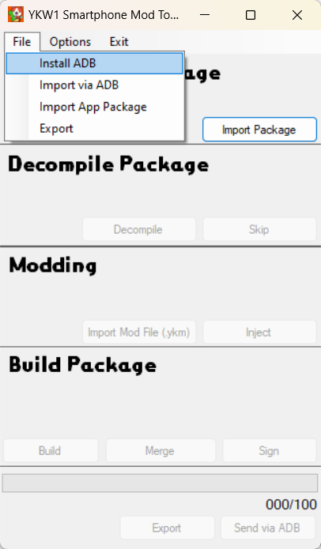
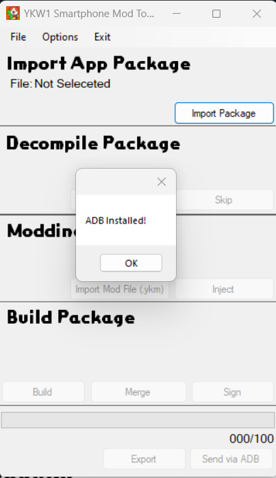
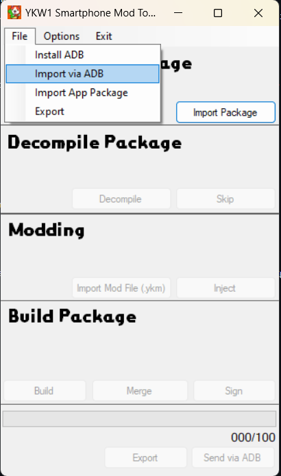
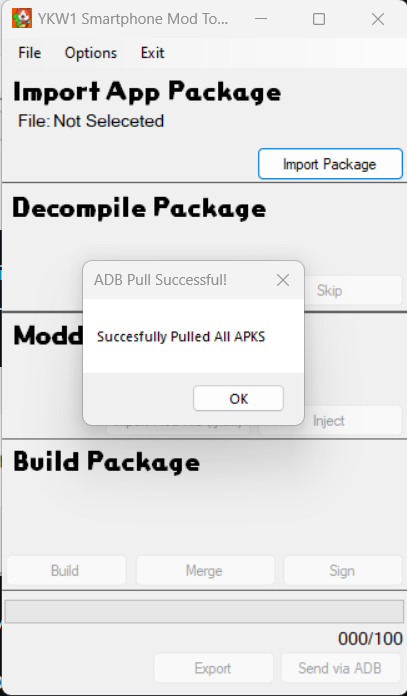
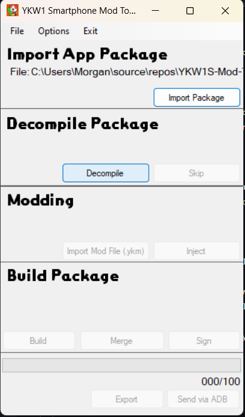
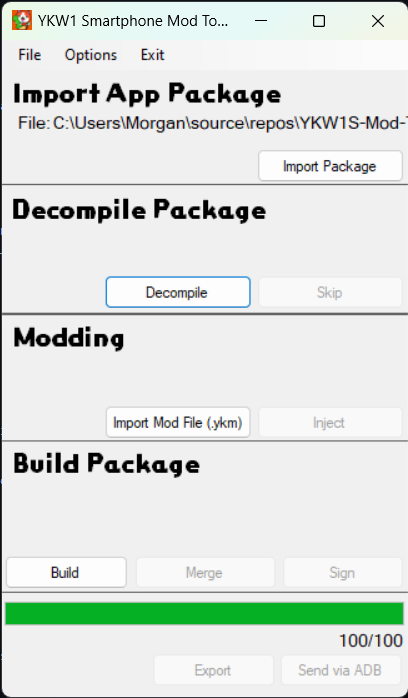

# Yo-Kai-Watch 1 Smartphone Mod Tools
This is a tool made for the use of injecting mods into ykw1 smartphone app. This should hopefully make development easier for the app aswell as implementing mods into the app. I hope you enjoy!

## How To Use 

1. After opening the application you will need to provide your YKW1 Smartphone app files. You can do this with ADB (Pretty Easy) or Extracting it yourself and locating it on your pc.

### ADB (Importing Package)
1. Go to File -> "Install ADB".

2. Wait until the install is completed

Make sure your phone is connected to your computer aswell as it has "USB Debugging" turned on.
3. After select File -> "Import Via ADB".

If yours closes immediately, make sure you allowed debugging on your phone and ADB is already running. After try re-clicking it.
4. Wait until you recieve "Succesfully Pulled APKS", do not mess with anything until you recieve this textbox.

5. After this your files should be pulled. 

### Pulling it yourself (Importing Package)
1. If you want to pull the files yourself I'd recommend using Lucky Patcher because it can handle .APKS files but its up to you.

2. After putting the file on your PC, Click "Import Package" and locate your .APKS/.ZIP.

##

### Decompiling

1. Click decompile (its not that complicated)
Note: If you have already decompiled it will allow you to skip this step.

Wait until the progress bar reaches 100% on the bottom progress bar.

### Modding
