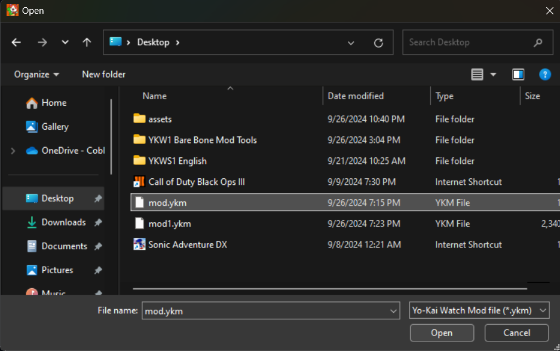
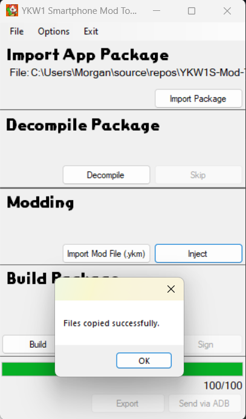
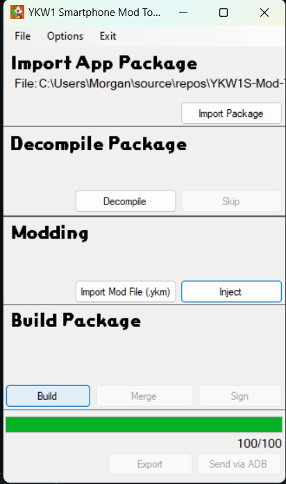
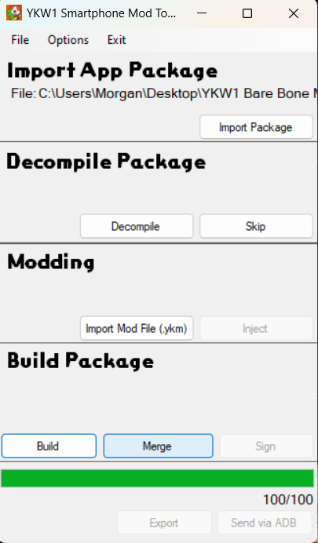
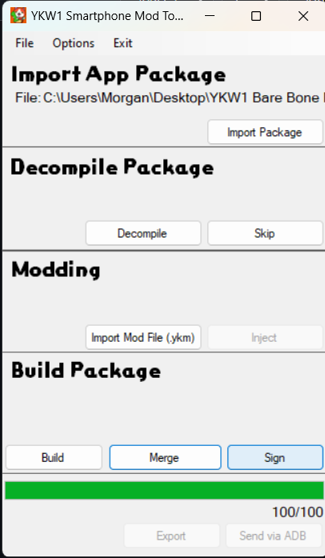

# Yo-Kai-Watch 1 Smartphone Mod Tools
This is a tool made for the use of injecting mods into ykw1 smartphone app. This should hopefully make development easier for the app aswell as implementing mods into the app. I hope you enjoy!

## Guide
After opening the application you will need to provide your YKW1 Smartphone app files. You can do this with ADB (Pretty Easy) or Extracting it yourself and locating it on your pc.

### ADB (Importing Package)
1. Go to File -> "Install ADB".

2. Wait until the install is completed

Make sure your phone is connected to your computer aswell as it has "USB Debugging" turned on.
3. After select File -> "Import Via ADB".

If yours closes immediately, make sure you allowed debugging on your phone and ADB is already running. After try re-clicking it.
4. Wait until you recieve "Succesfully Pulled APKS", do not mess with anything until you recieve this textbox.

5. After this your files should be pulled.

6. Make sure to put this icon.png file into ".\Unmodified APKS\ykw1_unzipped" or **IT WILL CRASH**

### Pulling it yourself (Importing Package)
1. If you want to pull the files yourself I'd recommend using Lucky Patcher because it can handle .APKS files but its up to you.

2. After putting the file on your PC, Click "Import Package" and locate your .APKS/.ZIP.

##

### Decompiling

1. Click decompile (its not that complicated)
Note: If you have already decompiled it will allow you to skip this step.

Wait until the progress bar reaches 100% on the bottom progress bar.

### Modding
1. Click "Import Mod File (.ykm)", locate the mod you wish to import , click "Open".

2. Click "Inject" and wait for "Files Copied Succesfully".
Note: If you get a "Failed to unzip mod error", clear your "Mods" folder.

### Compiling
1. After you finish importing your mods, click "Build". (This can take minutes)

2. Wait until it reaches 100% then click "Merge". (This can take minutes)

3. Wait until the CMD window closes then click "Sign". (This can take minutes)

4. Wait until the CMD window closes click "Export" and save it as you please.

## How Do You Make Mods?
You can make mods the same way you do for the switch copy. Editing and messing with .XI files, I recommend using Kurimmu2 and CfgBinEditor.

How do I make a .ykm file?
After completing your mod make sure its in a way where your directory is setup as assets->data->etc, Compress your assets folder into a .ZIP and rename it to YourMod.ykm

## Special Thanks To
[APKEditor](https://github.com/REAndroid/APKEditor)

[APKTool](https://github.com/iBotPeaches/Apktool)

[Uber-APK-Signer](https://github.com/patrickfav/uber-apk-signer)

[Enma Injector](https://github.com/NullGang/Enma-Injector/tree/main)
